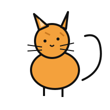
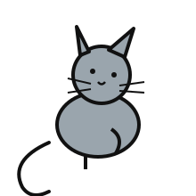
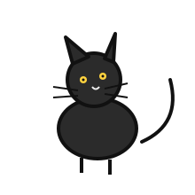
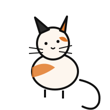
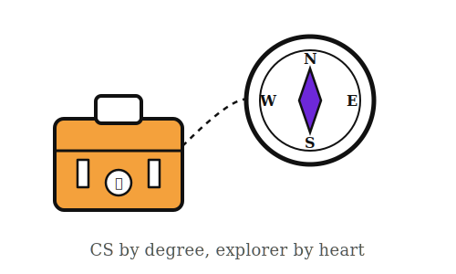

<!-- Header Section -->

  <strong>"Building cool things. Caring about where it all leads."</strong>

  

---

<!-- Narrative Intro Section -->

  <i>Part builder, part tech explorer; a wanderer who knows exactly what to do.</i> 
  I think of ideas that bridge the gap between complex problems and practical solutions, connecting technology, product vision, and real-world impact.

---

<!-- The Explorer's Log & System Metrics -->
<table border="0" width="100%">
  <tr border="0">
    <td width="50%" style="vertical-align: top;">
      <h3>📂 The Explorer's Log</h3>
      <ul>
        <li>🎓 <b>CS Undergrad</b></li>
        <li>💡 <b>Passions:</b> Product Thinking, Travel & Exploration, System Architecture</li>
        <li>🛠️ <b>Focus:</b> Product Management & Digital Experiences</li>
        <li>🌐 <b>Polyglot:</b> English, Urdu, Turkish (Learning)</li>
      </ul>
    </td>
    <td width="50%" style="vertical-align: top;">
      <h3>⚙️ System Metrics</h3>
      <pre align="left">
Daily Screen Time : [██████████████░░] 88%
Curiosity Level   : [███████████████░] 92%
Tabs Open         : [████████████████] ∞
Coffee Level      : [██████░░░░░░░░░░] 40% 
<i>(Status: Refill Required)</i>
      </pre>
    </td>
  </tr>
</table>

---

<!-- Cat Person Section -->
<h3>🐾 Confirmed Cat Person (Unlicensed, Unfortunately)</h3>

  <i>I am, scientifically and emotionally, a cat person.</i> 
  I have never owned a cat. My parents said no. The dream remains theoretical. 
  So here are the cats I would have, drawn into existence since real ones aren't allowed yet.

  
  
  
  

  Left to right: the one who'd knock things off tables, the one who judges silently, the one who's secretly the softest, and the one running the whole household.

---

<!-- Explorer Side Section -->
<h3>🧭 CS by Degree, Explorer by Heart</h3>

  

  <i>Being a CS student doesn't mean my whole world is code — I'm just as into wandering, exploring, and chasing curiosity outside the terminal.</i>

<table border="0" width="100%">
  <tr>
    <td width="50%" style="vertical-align: top;">
      <h4>🗺️ Places I've Wandered</h4>
      
Nowhere yet. My passport is tragically blank and purely theoretical at this point.

    </td>
    <td width="50%" style="vertical-align: top;">
      <h4>✈️ Places I'm Plotting</h4>
      <ul>
        <li>🗼 Japan</li>
        <li>🏔️ Switzerland</li>
        <li>🏛️ Turkey</li>
        <li>🌆 Basically anywhere with good food and a view</li>
      </ul>
    </td>
  </tr>
</table>

<h4>🔎 Currently</h4>
<pre align="left">
Currently learning     : AI from scratch (no libraries, the hard way)
Currently exploring    : new languages & new places (on paper, for now)
Currently obsessed with: the idea of finally using that blank passport
Currently procrastinating on: booking literally any of the above
</pre>

  

  😄 Kidding aside — if any airline, travel agency, or generous stranger wants to sponsor my very first trip, my inbox (and blank passport) are wide open.

---

<!-- Tech Constellation -->
<h3>🌌 Tech Constellation</h3>

  <b>Product & Design:</b> 
  
  
  

  <b>Languages & Core:</b> 
  
  
  
  
  

  <b>Frameworks & Tools:</b> 
  
  
  
  

---

<!-- GitHub Analytics -->
<h3>📊 Transmission Metrics</h3>

  
  

  

---

<!-- Connect Section -->
<h3>📡 Intercept the Signal</h3>

  
  
  

  

